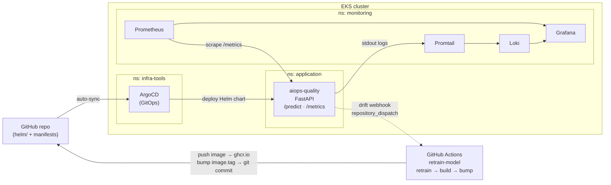
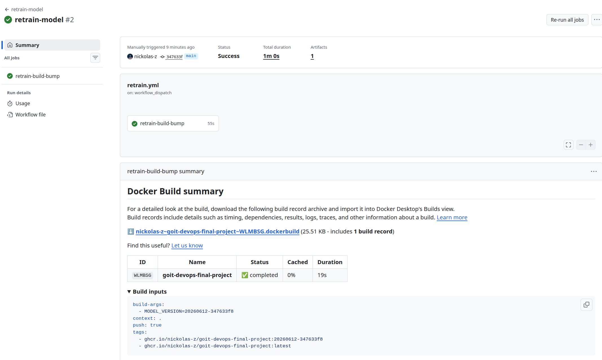
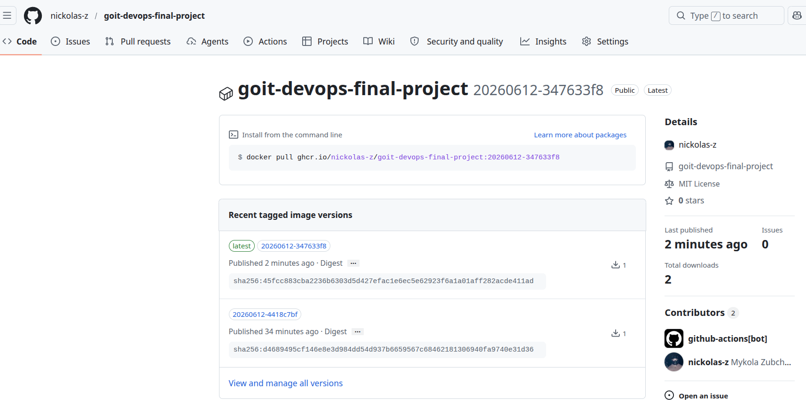
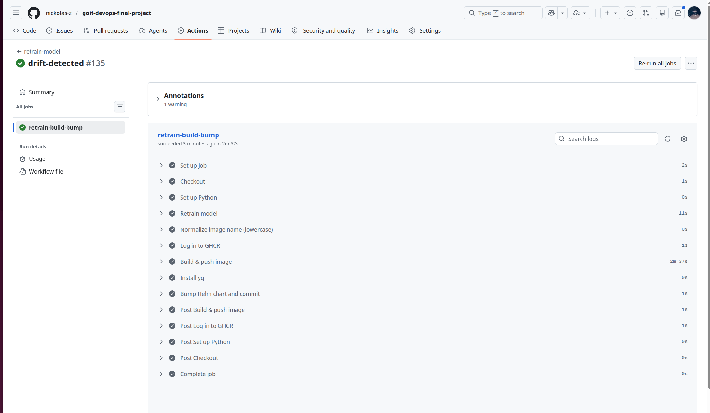
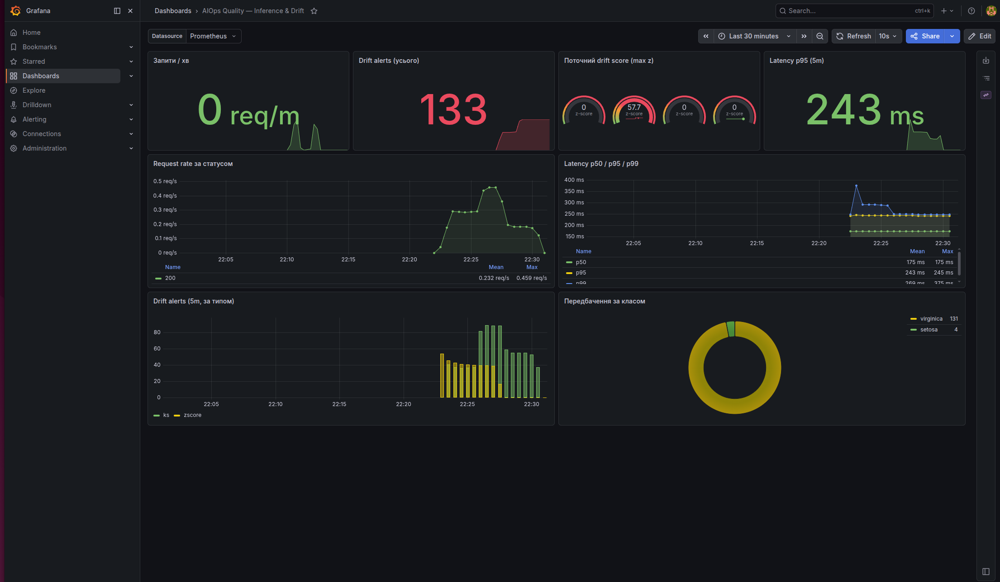

# AIOps Quality — Final Project

Фінальний проект MLOps/AIOps-конвеєр для inference-сервісу з контролем якості вхідних даних.
FastAPI-сервіс обгортає sklearn-модель, на кожен запит логує вхідні дані,
обчислює передбачення та перевіряє вхід на **дрейф**. У разі дрейфу подія потрапляє
в метрики/логи та тригерить **GitHub Actions** пайплайн `retrain-model`
(repository_dispatch), який перенавчає модель, збирає новий Docker-образ і оновлює
Helm-чарт. Далі **ArgoCD** через auto-sync вивантажує нову версію у кластер. Метрики
збирає **Prometheus**, візуалізує **Grafana**, логи stdout збирає **Loki + Promtail**.

## Архітектура



## Ключові компоненти

| Компонент | Реалізація |
| --- | --- |
| **Інфраструктура** | [infra/](infra/) — Terraform: VPC + EKS (`goit-eks-cluster`) + ArgoCD у `infra-tools`. |
| **FastAPI** | [app/main.py](app/main.py) — inference + `/metrics` + structured logging. Логіка у функції `predict()`. |
| **Drift-детектор** | [app/drift_detector.py](app/drift_detector.py) — z-score (per-request) + KS-тест (ковзне вікно), scipy. |
| **Модель** | [model/train.py](model/train.py) — `Pipeline(StandardScaler + SGDClassifier)` на Iris → `model.joblib` + `reference.json`. |
| **Helm-чарт** | [helm/](helm/) — Deployment, Service, ConfigMap (env), ServiceMonitor, опц. Secret/HPA. |
| **ArgoCD** | [argocd/application.yaml](argocd/application.yaml) — GitOps-деплой чарта, `auto-sync` + `self-heal`. |
| **Prometheus + Grafana** | [argocd/monitoring.yaml](argocd/monitoring.yaml) — kube-prometheus-stack; дашборд [grafana/dashboards.json](grafana/dashboards.json). |
| **Loki + Promtail** | [argocd/loki.yaml](argocd/loki.yaml) — loki-stack, Promtail збирає stdout подів. |
| **CI/CD (основний)** | [.github/workflows/retrain.yml](.github/workflows/retrain.yml) — GitHub Actions `retrain-model` → build → push `ghcr.io` → bump Helm. |
| **CI/CD (альтернатива)** | [.gitlab-ci.yml](.gitlab-ci.yml) — GitLab CI. |

## Структура проєкту

```text
goit-devops-final-project/
├── .github/
│   └── workflows/
│       └── retrain.yml               # CI/CD основний: GitHub Actions retrain→build(ghcr)→bump
├── infra/                            # Terraform: VPC + EKS + ArgoCD (піднімає кластер з нуля)
│   ├── main.tf                       # оркестрація: vpc → eks → (wait) → argocd
│   ├── variables.tf                  # region, cluster_name, розміри node group…
│   ├── outputs.tf                    # kubeconfig / argocd port-forward / admin-pass команди
│   ├── terraform.tf                  # provider-и (aws, kubernetes, helm) + backend
│   ├── vpc/                          # модуль VPC (terraform-aws-modules/vpc ~> 5.0)
│   ├── eks/                          # модуль EKS (terraform-aws-modules/eks ~> 20.0)
│   └── argocd/                       # ArgoCD через helm_release + values/argocd-values.yaml
├── app/
│   ├── main.py                       # FastAPI-інференс (predict, /metrics, логування, drift)
│   ├── drift_detector.py             # z-score + KS-тест детектор дрейфу
│   └── requirements.txt
├── model/
│   ├── train.py                      # retrain → model.joblib + reference.json
│   ├── model.joblib                  # артефакт моделі (комітиться, оновлюється в CI)
│   ├── reference.json                # reference-статистика для drift-детектора
│   └── requirements.txt
├── helm/
│   ├── Chart.yaml                    # version / appVersion (== тег образу == версія моделі)
│   ├── values.yaml                   # image, port, env, serviceMonitor, webhook…
│   └── templates/                    # deployment, service, configmap, servicemonitor, …
├── argocd/
│   ├── application.yaml              # ArgoCD Application для сервісу (auto-sync + self-heal)
│   ├── monitoring.yaml               # kube-prometheus-stack (Prometheus + Grafana)
│   ├── loki.yaml                     # Loki + Promtail
│   └── grafana-dashboard.yaml        # ArgoCD App: дашборд як ConfigMap (GitOps)
├── prometheus/
│   └── additionalScrapeConfigs.yaml  # додатковий scrape-конфіг (альтернатива ServiceMonitor)
├── grafana/
│   ├── dashboards.json               # дашборд: запити/хв, latency, drift alerts
│   └── kustomization.yaml            # configMapGenerator → ConfigMap для Grafana sidecar
├── docs/
│   └── img/                          # скриншоти кроків для README (+ чеклист)
├── Dockerfile                        # образ inference-сервісу
├── .gitlab-ci.yml                    # retrain-пайплайн (альтернатива GitLab CI)
└── README.md
```

## Конфігурація за замовчуванням

| Параметр | Значення |
| --- | --- |
| AWS Region | `us-east-1` |
| AWS Profile | `devops` |
| EKS Cluster | `goit-eks-cluster` |
| ArgoCD Namespace | `infra-tools` |
| Сервіс Namespace | `application` |
| Monitoring Namespace | `monitoring` |
| Контейнерний порт | `8000` |
| Service port | `80` |
| Модель / класи | Iris → `setosa`, `versicolor`, `virginica` |
| Ознаки | `sepal_length`, `sepal_width`, `petal_length`, `petal_width` |

## Передумови

| Інструмент | Версія | Навіщо |
| --- | --- | --- |
| AWS CLI | >= 2 | доступ до AWS; профіль `devops` (`aws configure --profile devops`) |
| Terraform | >= 1.3 | підняти VPC + EKS + ArgoCD з [infra/](infra/) |
| kubectl | >= 1.28 | робота з кластером |
| Helm | >= 3.12 | рендер/деплой чарта |
| Python | >= 3.10 | локальний запуск/тренування |
| Docker | >= 24 | локальний build образу |
| ArgoCD CLI | опціонально | зручніше дивитись sync-статус |


---

**Передумова:** AWS-акаунт + налаштований профіль `devops`
(`aws configure --profile devops`) і встановлені Terraform / kubectl / Helm. 
Кластер та ArgoCD створює Terraform на Кроці 0.


### Інфраструктура — VPC + EKS + ArgoCD (Terraform)

```bash
cd infra
terraform init
terraform apply -auto-approve      # ~15–20 хв
kubectl get nodes                  # kubeconfig проставляється автоматично
cd ..
```

**Приклад виводу:**

```shell
Apply complete! Resources: 66 added, 0 changed, 0 destroyed.

Outputs:

argocd_initial_admin_password_command = "kubectl -n infra-tools get secret argocd-initial-admin-secret -o jsonpath='{.data.password}' | base64 -d"
argocd_namespace = "infra-tools"
argocd_port_forward_command = "kubectl -n infra-tools port-forward svc/argocd-server 8080:80"
cluster_certificate_authority_data = <sensitive>
cluster_endpoint = "https://0352B0A03767DE397DA5A3D45F659D47.gr7.us-east-1.eks.amazonaws.com"
cluster_name = "goit-eks-cluster"
kubeconfig_command = "aws eks --region us-east-1 update-kubeconfig --name goit-eks-cluster --profile devops"
private_subnet_ids = [
  "subnet-0241621fe1efc6371",
  "subnet-01cd806df202d3b3c",
]
vpc_id = "vpc-0d131789b7a4e1315"


❯ kubectl get nodes
NAME                         STATUS   ROLES    AGE     VERSION
ip-10-0-1-131.ec2.internal   Ready    <none>   10m     v1.33.11-eks-3385e9b
ip-10-0-2-203.ec2.internal   Ready    <none>   9m37s   v1.33.11-eks-3385e9b

❯ kubectl -n infra-tools get pods
NAME                                                READY   STATUS    RESTARTS        AGE
argocd-application-controller-0                     1/1     Running   0               8m44s
argocd-applicationset-controller-78bcd8564f-z5npp   1/1     Running   0               8m44s
argocd-dex-server-7ccb4b765b-75jc4                  1/1     Running   1 (8m36s ago)   8m44s
argocd-redis-d6bcfc99c-6znbt                        1/1     Running   0               8m44s
argocd-repo-server-5d8d78598-j785f                  1/1     Running   0               8m44s
argocd-server-69dbb986f6-6qn5b                      1/1     Running   0               8m44s
```

### Перший образ у GitHub Container Registry (ghcr.io)

ArgoCD тягне образ `ghcr.io/<...>`; до першого деплою образ має існувати. Потрібно запустити
GitHub Actions один раз: вкладка **Actions → retrain-model → Run workflow → main**.
Пайплайн запушить ghcr `:latest` і `:<MODEL_VERSION>` та пропише `image.tag` у helm/.
Зробіть пакет публічним: **Packages → Package settings → Change visibility → Public**.

```bash
# Альтернатива без CI — вручну:
echo $GHCR_PAT | docker login ghcr.io -u nickolas-z --password-stdin
docker build --build-arg MODEL_VERSION=0.1.0 \
  -t ghcr.io/nickolas-z/goit-devops-final-project:0.1.0 .
docker push ghcr.io/nickolas-z/goit-devops-final-project:0.1.0
```





### Секрет webhook у namespace `application`

```bash
kubectl create namespace application 2>/dev/null || true
# GitHub PAT (scope repo) для repository_dispatch:
kubectl -n application create secret generic aiops-quality-webhook \
  --from-literal=token=<GITHUB_PAT>
```

**Приклад виводу:**

```shell
namespace/application created
secret/aiops-quality-webhook created

❯ kubectl -n application get secret aiops-quality-webhook \
  -o jsonpath='{.data.token}' | base64 -d | head -c 7; echo "...(ok)"

ghp_xxx...(ok)
```

### Webhook URL для авто-retrain

У [argocd/application.yaml](argocd/application.yaml) задайте `retrainWebhook.url`
(можна пропустити — без url дрейф усе одно логується, лише не тригерить retrain):

```yaml
retrainWebhook:
  kind: github
  url: "https://api.github.com/repos/nickolas-z/goit-devops-final-project/dispatches"
  event: drift-detected
  existingSecret: aiops-quality-webhook
```


### Реєстрація ArgoCD Applications

```bash
kubectl apply -n infra-tools -f argocd/application.yaml        # сервіс
kubectl apply -n infra-tools -f argocd/monitoring.yaml         # Prometheus+Grafana
kubectl apply -n infra-tools -f argocd/loki.yaml               # Loki+Promtail
kubectl apply -n infra-tools -f argocd/grafana-dashboard.yaml  # дашборд
```

**Приклад виводу:**

```shell
Warning: metadata.finalizers: "resources-finalizer.argocd.argoproj.io": prefer a domain-qualified finalizer name including a path (/) to avoidaccidental conflicts with other finalizer writers
application.argoproj.io/aiops-quality created
application.argoproj.io/monitoring created
application.argoproj.io/loki created
application.argoproj.io/aiops-grafana-dashboard created
```

### Дочекатися Synced/Healthy і Running

```bash
kubectl get applications -n infra-tools
kubectl get pods -n application
```

**Приклад виводу:**

```shell
❯ kubectl get applications -n infra-tools
NAME                      SYNC STATUS   HEALTH STATUS
aiops-grafana-dashboard   Synced        Healthy
aiops-quality             Synced        Healthy
loki                      Synced        Healthy
monitoring                Synced        Healthy

❯ kubectl get pods -n application
NAME                            READY   STATUS    RESTARTS   AGE
aiops-quality-88bc5bcfc-2lfpp   1/1     Running   0          18m
aiops-quality-88bc5bcfc-klrrn   1/1     Running   0          18m
```

### Перевірка

```bash
kubectl -n application port-forward svc/aiops-quality 8000:80 &
curl -s localhost:8000/predict -X POST -H 'Content-Type: application/json' \
  -d '{"features": [[5.1, 3.5, 1.4, 0.2]]}' | jq

# Згенерувати дрейф і знайти подію в логах:
for i in $(seq 1 50); do curl -s -X POST localhost:8000/predict \
  -H 'Content-Type: application/json' -d '{"features": [[40,25,60,45]]}' >/dev/null; done
kubectl -n application logs -l app.kubernetes.io/name=aiops-quality | grep "Drift detected"
```

**Приклад виводу**:

```json
{
  "model_version": "20260612-347633f8",
  "predictions": [
    {
      "predicted_class": 0,
      "predicted_label": "setosa",
      "probabilities": [
        0.908545,
        0.091352,
        0.000104
      ]
    }
  ],
  "drift_detected": true,
  "drift_detail": {
    "drift": true,
    "kind": "ks",
    "max_z": 1.3402,
    "p_values": {
      "sepal_length": 0.0,
      "sepal_width": 0.0,
      "petal_length": 0.0,
      "petal_width": 0.0
    },
    "offending_features": [
      "sepal_length",
      "sepal_width",
      "petal_length",
      "petal_width"
    ],
    "window_filled": true
  }
}
```

```shell
❯ for i in $(seq 1 50); do curl -s -X POST localhost:8000/predict \
  -H 'Content-Type: application/json' -d '{"features": [[40,25,60,45]]}' >/dev/null; done
kubectl -n application logs -l app.kubernetes.io/name=aiops-quality | grep "Drift detected"
Handling connection for 8000
Drift detected
```




---

## Згортання проєкту (teardown)

Щоб зупинити всі витрати AWS — знести інфраструктуру у зворотному порядку.

```bash
kubectl delete -n infra-tools application \
  aiops-quality monitoring loki aiops-grafana-dashboard

cd infra
terraform destroy            # підтвердити yes; ~10–15 хв
cd ..
```

**Приклад виводу**:
```shell
module.eks.module.eks.aws_security_group.node[0]: Destruction complete after 1s
module.vpc.module.vpc.aws_vpc.this[0]: Destroying... [id=vpc-0d131789b7a4e1315]
module.vpc.module.vpc.aws_vpc.this[0]: Destruction complete after 1s
╷
│ Warning: Helm uninstall returned an information message
│ 
│ These resources were kept due to the resource policy:
│ [CustomResourceDefinition] applications.argoproj.io
│ [CustomResourceDefinition] applicationsets.argoproj.io
│ [CustomResourceDefinition] appprojects.argoproj.io
│ 
╵

Destroy complete! Resources: 66 destroyed.
```


**Перевірка, що нічого не лишилось (не тарифікується):**

```bash
aws eks list-clusters --region us-east-1 --profile devops
aws ec2 describe-vpcs --region us-east-1 --profile devops \
  --filters Name=tag:Project,Values=goit-devops
```

**Приклад виводу**:
```shell
❯ aws eks list-clusters --region us-east-1 --profile devops
aws ec2 describe-vpcs --region us-east-1 --profile devops \
  --filters Name=tag:Project,Values=goit-devops

{
    "clusters": []
}
{
    "Vpcs": []
}
```
